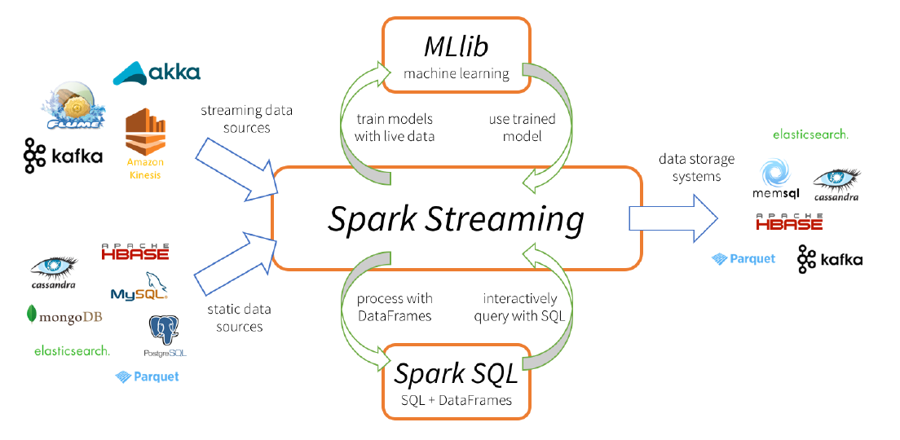

# **<u>Criando pipelines de dados eficientes - Parte 1 (Spark Streaming e PySpark)</u>**

------

[slides](./slides/slides_live_09.pdf)

notebooks:

- [PySpark_everis_p1.ipynb](./arquivos/PySpark_everis_p1.ipynb)

  

Spark

- Spark como uma abstração: permite que os desenvolvedores criem rotinas de processamento de dados complexas e de vários estágios, fornecendo uma API de alto nível e uma estrutura tolerante a falhas que permite aos programadores se concentrar na lógica em vez de questões ambientais ou de infraestrutura, como falha de hardware.
- Spark é rápido, eficiente e escalonável: implementa uma estrutura distribuída e tolerante a falhas na memória chamada Resilient Distributed Dataset (RDD) . O Spark maximiza o uso de memória em várias máquinas, melhorando o desempenho geral em ordens de magnitude. A reutilização dessas estruturas
  na memória pelo Spark o torna adequado para operações iterativas de aprendizado de máquina, bem como para consultas interativas.

Aplicabilidade

- Operações de extração-transformação-carregamento (load) - ETL
- Análise preditiva e aprendizagem de máquina
- Operações de acesso a dados (como consultas e visualizações SQL)
- Mineração e processamento de texto
- Processamento de eventos em tempo real
- Aplicativos gráficos
- Reconhecimento de padrões
- Mecanismos de recomentação

Linguagens que podemos usar em programas Spark: Scala, Python, Java, SQL e R.

Exemplos RDD:

- Python

```python
rddArquivo = sc.textFile ("hdfs://meucluster/data/arquivo.txt")
```

- Scala

```scala
val rddArquivo = sc.textFile("hdfs:// meucluster/data/arquivo.txt")
```

- Java

```java
JavaRDD<String> rddArquivo = sc.textFile("hdfs://meucluster/data/arquivo.txt");
```


Podemos utilizar o Spark de maneira interativa c/ pyspark (Python) ou spark-shell (Scala) 

Ou não-interativa através do spark-submit:

```shell
[linux@user ~]$ spark-submit \
--master yarn \ # define o gerenciador de recursos (yarn)
--queue "SquadFI" \ # especificando uma fila - [não obrigatória] [boa prática]
--name "[Programa Spark 123] ETL 999" \
--driver-memory 2G \
--executor-memory 2G \
--executor-cores 1 \
--proxy-user hive \
--conf "spark.driver.maxResultSize=16g" \
--conf "spark.dynamicAllocation.enabled=true" \ # habilita a alocação dinâmica de recursos - [não obrigatória] [boa prática]
--conf "spark.shuffle.service.enabled=true" \
--conf "spark.shuffle.service.port=7337" \
--conf "spark.dynamicAllocation.initialExecutors=10" \ # define o nr. de executores inicial - [não obrigatória] [boa prática]
--conf "spark.dynamicAllocation.minExecutors=10" \ # define o mínimo de executores - [não obrigatória] [boa prática]
--conf "spark.dynamicAllocation.maxExecutors=80" \ # define o máximo de executores - [não obrigatória] [boa prática]
--conf "spark.yarn.driver.memoryOverhead=2000" \
--conf "spark.yarn.executor.memoryOverhead=2000" \
--driver-java-options "-Djavax.security.auth.useSubjectCredsOnly=false" \
--jars commons-csv-1.2.jar,spark-csv_2.11-1.5.0.jar \ # importa bibliotecas
Main.py <parametro 1> <parametro 2> <parametro N>
```


**Estrutura**


DRIVER
A vida útil do aplicativo Spark começa (e termina) com o driver Spark. O driver Spark é o processo que os clientes usam para enviar aplicativos no Spark.

- O driver também é responsável por:
  - planejar e coordenar a execução do programa Spark e retornar o status e/ou resultados (dados) ao cliente.
  - por criar o SparkContext. O SparkContext, é referido como sc, é a instância do aplicativo que representa a conexão com o Master do Spark (e os Workers do Spark). O SparkContext é instanciado no início de um aplicativo Spark (incluindo os shells interativos) e é usado para todo o programa.

- Uma das principais funções do driver é planejar o aplicativo.
- O driver obtém a entrada de processamento do aplicativo e planeja a execução do programa.
- O driver pega todas as transformações solicitadas (operações de manipulação de dados) e ações (solicitações de saída ou um prompt para executar o programa) e cria um Gráfico Acíclico Direcionado (Directed Acyclic Graph - DAG).


CLUSTER MANAGER

O Cluster Manager é o processo responsável por monitorar os nós Workers e reservar recursos nesses nós mediante solicitação do Spark Master. O Spark Master, por sua vez, disponibiliza esses recursos de cluster para o Driver na forma de executores.

O Cluster Manager pode ser separado do processo Master. Esse é o caso ao executar o Spark no Mesos ou YARN.

No caso do Spark rodando no modo Standalone, o processo Master também executa as funções do Cluster Manager. Efetivamente, ele atua como seu próprio gerenciador de cluster.

- O Cluster Manager em um aplicativo Spark distribuído é o processo que governa, monitora e reserva recursos na forma de contêineres em nós de worker de cluster (ou escravos). Esses contêineres são reservados mediante solicitação do Spark Master. O Cluster Manager no caso do Spark no YARN é o YARN ResourceManager.
- Um Spark Driver em execução no modo YARN envia um aplicativo ao ResourceManager e, em seguida, o ResourceManager designa um ApplicationsMaster para o aplicativo Spark.

Um aplicativo Spark gerenciado pelo YARN mostrado no ResourceManager UI, normalmente disponível em
http://<resource_manager>:8088


SPARK MASTER
O Spark master é o processo que solicita recursos no cluster e os disponibiliza para o driver Spark. Em qualquer modo de implantação, o mestre negocia recursos ou contêineres com nós de trabalho ou nós escravos e rastreia seu status e monitora seu progresso.
O processo mestre do Spark atende a uma interfae de usuário da web na porta 8080 no host mestre:

- O processo ApplicationsMaster que é instanciado pelo ResourceManager no envio do aplicativo Spark atua como o Spark Master. O Driver informa o ApplicationsMaster sobre os requisitos de seu executor para o aplicativo.
- O ApplicationsMaster, por sua vez, solicita containers (que são hospedados em NodeManagers) do ResourceManager para hospedar esses executores.
- O ApplicationsMaster é responsável por gerenciar esses containers (executors) durante o ciclo de vida do aplicativo Spark.
- O Driver coordena o estado do aplicativo e as transições de estágio de processamento.
- O próprio ApplicationsMaster é hospedado em uma JVM em um nó slave ou worker no cluster e é, na verdade, o primeiro recurso alocado para qualquer aplicativo Spark em execução no YARN.


Modo Cluster


Modo Cluster (Yarn-Cluster)

1. O Client (uma chamada de processo do usuário via spark-submit) envia um aplicativo Spark para o Cluster Manager (o YARN ResourceManager).
2. O ResourceManager atribui um ApplicationsMaster (o Spark Master) para o aplicativo. O processo do Driver é criado no mesmo nó.
3. O ApplicationsMaster solicita containers para os Executors do ResourceManager. Os contêineres são atribuídos e os executors são gerados. O Driver então se comunica com os executors para organizar o processamento de tarefas e estágios do programa Spark.
4. O driver retorna o progresso, resultados e status para o cliente.


Iniciando

- em modo interativo

```shell
# local: executa a aplicação em modo local usando 1 core
# local[n]: executa a aplicação em modo local usando n cores (se for *, usa todos os cores disponíveis)
# local[n,m]: executa a aplicação em modo local usando n cores (se for *, usa todos os cores disponíveis) e repetindo as tarefas c/ falha m vezes 
[linux@user ~]$ pyspark --master local
```

- em modo não-interativo (aplicativo em Spark-submit ou notebooks)

```shell
from pyspark import SparkContext
sc = SparkContext ("local [*]")
# ...
# o código do seu aplicativo ...
```


Por que utilizarmos Spark Streaming

- Processamento de eventos em tempo real em sistemas de big data
- De sensores e processamento de dados de rede à detecção de fraudes e monitoramento de sites e muito mais
- Capacidade de consumir, processar e obter insights de fontes de dados de streaming
- Os objetivos para Spark Streaming incluíam:
  - Latência baixa (segunda escala)
  - Processamento de evento único (e apenas uma vez)
  - Escalabilidade linear
  - Integração com Spark Core API

- Necessidade do processamento de eventos/fluxos como um componente-chave
- Processamento de eventos integrado com sua estrutura de lote baseada em RDD
- A abordagem Spark Streaming
- Spark Streaming apresenta o conceito de "discretized streams" (ou DStreams)
- DStreams são essencialmente lotes de dados armazenados em vários RDDs, cada lote representando uma janela de tempo (normalmente em segundos)
- Os RDDs resultantes podem ser processados usando a API Spark RDD principal e todas as transformações disponíveis


**Revisão**

Assim como acontece com os pontos de entrada do programa SparkContext, SQLContext e HiveContext que discuti antes, os aplicativos Spark Streaming também têm um ponto de entrada chamado StreamingContext

- Aplicação Spark = Driver + grupo de Executors
- Driver executa o processo principal e cria um SparkContext que serve para coordenar a execução do seu job.
- Os executors são processos em execução nos work nodes responsável por executar tasks que o Driver atribuiu a ele.
- O cluster manager (Yarn, Mesos) é responsável pela alocação de recursos para seu aplicativo Spark.
  O Spark

Context é usado pelo processo do Spark Driver do seu aplicativo Spark para estabelecer uma comunicação
com o cluster e o cluster manager (Yarn) para então coordenar e executar jobs.

SparkContext também permite o acesso a outros dois contextos, ou seja, SQLContext e HiveContext.

Para criar um SparkContext, primeiro você precisa criar uma configuração, chamada de SparkConf.

- SQLContext é o ponto de entrada para SparkSQL, que é um módulo Spark para processamento de dados estruturados.
- Depois que o SQLContext é inicializado, o usuário pode usá-lo para realizar várias operações "semelhantes a sql" em conjuntos de dados e dataframes.
- Para criar um SQLContext, primeiro você precisa instanciar um SparkContext.
- Se o seu aplicativo Spark precisa se comunicar com o Hive e você está usando o Spark <2.0, provavelmente precisará de um HiveContext.

Exemplos (Python e Scala)

```python
# PySpark
from pyspark import SparkContext, HiveContext # importa as bibliotecas
conf = SparkConf().setAppName ('app').setMaster (master) # define as configurações
sc = SparkContext (conf) # cria um contexto do Spark c/ as configurações anterior
hive_context = HiveContext (sc) # cria contexto do Hive (necessário para Spark < 2.0 c/ o SparkContext
hive_context.sql ("select * from tableName limit 0") # executa instrução SQL em tabela no Hive
```

```scala
// Scala – Acessando o Context
import org.apache.spark.{SparkConf, SparkContext}
import org.apache.spark.sql.hive.HiveContext
val sparkConf = new SparkConf().setAppName("app").setMaster("yarn")
val sc = new SparkContext(sparkConf)
val hiveContext = new HiveContext(sc)
hiveContext.sql("select * from tableName limit 0")
```

O Spark 2.0 introduziu o SparkSession que substituiu essencialmente SQLContext e HiveContext e concede
acesso imediato ao SparkContext.

Criar um Spark Session com suporte a Hive:

```python
# PySpark
from pyspark.sql import SparkSession
spark_session = SparkSession.builder.enableHiveSupport().getOrCreate()
# Duas maneiras de acessar o contexto do spark a partir da sessão do spark
spark_context = spark_session._sc
spark_context = spark_session.sparkContext
```


Stream Context

- O StreamingContext representa uma conexão a uma plataforma ou cluster Spark usando um SparkContext existente
- O StreamingContext é usado para criar os datasources de DStreams controlar a computação de streaming e as transformações de DStream.
- O StreamingContext também especifica o argumento batchDuration, que é um intervalo de tempo em
  segundos pelo qual os dados de streaming serão divididos em lotes.
- Depois de instanciar um StreamingContext, você criaria uma conexão com um fluxo de dados e definiria uma série de transformações a serem realizadas.
- O método start() ou ssc.start() é usado para acionar a os dados de entrada depois que um StreamingContext é estabelecido.
- O StreamingContext pode ser interrompido programaticamente usando ssc.stop() ou ssc.awaitTermination().

- Discretized streams (DStreams) são o objeto de programação básico na API Spark Streaming
- Streams representam uma sequência contínua de RDDs que são criados a partir de um fluxo contínuo de dados
- DStreams podem ser criados a partir de fontes de dados de streaming, como soquetes TCP, sistemas de mensagens, APIs de streaming (como a API de streaming do Twitter) e muito mais.
- DStreams (como uma abstracção RDD) também pode ser produzido a partir de transformações realizadas na DStreams existentes (tais como map, flatMap e outras operações).
- DStreams oferece suporte a dois tipos de operações:
  1. Imagem Transformações
  2. Imagem Operações de saída

- DStreams são Lazy Evaluation assim como Spark RDD
- Representação de um discretized stream, com cada intervalo t representando uma janela de tempo
  especificada pelo batchDurationargumento na instanciação de StreamingContext:


- DStreams Source são definidos em um StreamingContext para um fluxo de dados de entrada especificado, da mesma forma que os RDDs são criados para uma fonte de dados de entrada em um SparkContext
- Muitas fontes de entrada de streaming comuns estão incluídas na API de streaming, como fontes para ler dados de um soquete TCP ou para ler dados enquanto eles estão sendo gravados no HDFS
- As fontes básicas de dados de entrada para a criação de DStreams são descritas aqui:
  socketTextStream()
- StreamingContext.socketTextStream (hostname, port, storageLevel = StorageLevel (True, True, False, False, 2))
- O método socketTextStream é usado para criar um DStream a partir de uma fonte TCP de entrada definida pelos argumentos hostnamee e port.
- Os dados recebidos são interpretados usando a enconding UTF8, com terminação de nova linha usada
  para definir novos registros.
- O storageLevelargumento que define o storage level padrão MEMORY_AND_DISK_SER_2


Usando Databricks

https://community.cloud.databricks.com/login.html

1. criar cluster (Databricks Runtime Version: default )
2. criar novo notebook (lenguage: Python, cluster: criado anteriormente);

ver [PySpark_everis_p1](./arquivos/PySpark_everis_p1.ipynb)(Notebook DataBricks)


Casos de USO

​	"TORPEDÃO DO FAUSTÃO"

1. recebe SMSs via API
2. ler a streaming c/ o SparkStreaming
3. Persiste as informações no HBase
4. uso o PHOENIX como interface entre o HBase e o MicroStrategy
5. Visualizo usando o MicroStrategy


Compatibilidade



