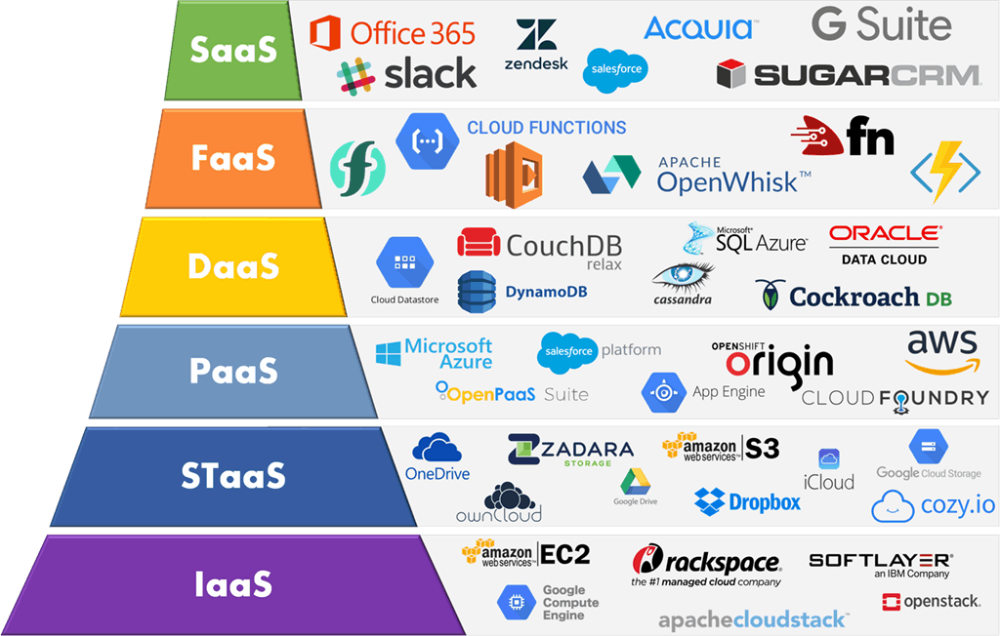

# **<u>Orquestrando Big Data em Ambiente de Nuvem</u>**

------

[slides](./slides/slides_live_11.pdf)

Computação em Nuvem

A computação em nuvem é a entrega de recursos de TI sob demanda por meio da Internet com definição de preço de pagamento conforme o uso. Em vez de comprar, ter e manter datacenters e servidores físicos, você pode acessar serviços de tecnologia, como capacidade computacional, armazenamento e bancos de dados, conforme a necessidade, usando um provedor de nuvem como a Amazon Web Services (AWS).

Infraestrutura como serviço (IaaS)

A infraestrutura como um serviço, às vezes abreviada como IaaS , contém os componentes básicos da TI em nuvem e, geralmente, dá acesso (virtual ou no hardware dedicado) a recursos de rede e computadores, como também espaço para o armazenamento de dados.

[Modelos de computação em nuvem (aws)](https://aws.amazon.com/pt/types-of-cloud-computing/)

Plataforma como serviço (PaaS)

Em plataformas como um serviço, não há necessidade de gerenciar a infraestrutura subjacente (geralmente, hardware e sistemas operacionais), permitindo que você se concentre na implantação e no gerenciamento das suas aplicações. Isso o ajuda a tornar se mais eficiente, pois elimina as suas preocupações com aquisição de recursos , planejamento de capacidade, manutenção de software, patching ou qualquer outro tipo de trabalho pesado semelhante envolvido na execução da sua aplicação.

Software como um serviço (SaaS)

O software como um serviço oferece um produto completo, executado e gerenciado pelo provedor de serviços. Na maioria dos casos, as pessoas que se referem ao software como um serviço estão se referindo às aplicações de usuário final

Um exemplo comum de aplicação do SaaS é o webmail, no qual você pode enviar e receber e-mails sem precisar gerenciar recursos adicionais para o produto de e mail ou manter os servidores e sistemas operacionais no qual o programa de e mail está sendo executado.

Visão de Mercado (camadas e suas ferramentas)

Implementação

Nuvem Privada
Uma nuvem privada é projetada e operada por uma empresa.
Pode ser hospedada interna ou externamente, e gerenciada por uma equipe interna ou até mesmo terceirizada.
No geral, apresenta alto nível de segurança , e faz uso das infra de rede interna da empresa

Nuvem Pública
Neste modelo, a nuvem á aberta ao público e qualquer um pode utilizá la (pagando uma taxa, geralmente).
É de propriedade de um provedor de serviços de nuvem

Nuvem Híbrida
Aqui, os modelos de nuvem pública e privada são combinados para oferecer um serviço diferenciado, que permite:

- Armazenar informações sigilosas na parte privada
- Usar recursos da nuvem pública não presentes na nuvem privada
- Combina alta eficiência com segurança aumentada

Provedor de Cloud AWS

Serviços AWS

Grupo de Serviços

- Amazon Computer Services

  - O **Amazon Elastic Compute Cloud Amazon (EC2)** é um serviço Web que disponibiliza capacidade computacional segura e redimensionável na nuvem. Ele foi projetado para facilitar a computação em nuvem na escala da web para os desenvolvedores
  - O **Amazon Elastic Container Service (ECS)** é um serviço gerenciado de orquestração de
    contêineres
  - O **Amazon Elastic Kubernetes Service (EKS)** é um serviço kubernetes totalmente gerenciado
  - O **AWS Fargate** é um mecanismo de computação sem servidor para contêineres. ele elimina a necessidade de provisionar e gerenciar servidores, permite que você especifique e pague pelos recursos por aplicativo.
    O Fargate aloca a quantidade certa de computação, eliminando a necessidade de escolher instâncias e ajustar a escala da capacidade do cluster.
  - O **AWS Lambda** é um serviço de computação sem servidor que executa código em resposta a eventos e gerencia automaticamente os recursos computacionais subjacentes para você.

- Amazon Network Services 

  - O **Amazon CloudFront** é um serviço rápido de rede de entrega de conteúdo CDN Content Delivery Network) que entrega dados, vídeos, aplicações e, APIs a clientes em todo o mundo com segurança, baixa latência e altas velocidades de transferência em um ambiente de uso facilitado para desenvolvedores
  - O **Amazon API Gateway** é um serviço gerenciado que permite que desenvolvedores criem, publiquem, mantenham, monitorem e protejam APIs em qualquer escala com facilidade
  - O **Amazon Route 53** é um web service Domain Name System ( DNS ) na nuvem altamente disponível e escalável.
  - O **AWS Virtual Private Network (AWS VPN)** permite estabelecer um túnel criptografado
    seguro e privado da sua rede ou dispositivo para a rede global da AWS
  - O **AWS Direct Connect** é um serviço de nuvem que facilita estabelecer uma conexão de rede dedicada do seu local de hospedagem para a AWS

- Amazon Storage Services

  - O **Amazon S3 (Simple Storage Service)** é um serviço escalonável, de alta velocidade e baixo custo baseado na web, projetado para backup online e arquivamento de dados e programas de aplicativos. Permite fazer upload, armazenamento e download de qualquer tipo de arquivo de até 5 TB
  - O **Amazon Elastic Block Store (EBS)** é um serviço de armazenamento em bloco fácil de usar e de alta performance, projetado para uso com o Amazon Elastic Compute Cloud (EC2) para taxas de transferência e cargas de trabalho intensivas de transações em qualquer escala.
  - O **Amazon S3 Glacier** é um serviço de armazenamento de custo extremamente baixo, que disponibiliza armazenamento seguro, durável e flexível para backup e arquivamento de dados.
  - O **Amazon Elastic File System (Amazon EFS)** fornece um sistema de arquivos NFS elástico, simples, escalável e totalmente gerenciado para uso com os serviços de nuvem AWS e os recursos no local.

- Amazon Security Services

  - O **AWS Identity and Access Management (IAM)** permite que você gerencie com segurança o
    acesso aos serviços e recursos da AWS
  - A autoridade de certificados (AC) privada do **AWS Certificate Manager (ACM)** é um serviço gerenciado de AC privada que ajuda a gerenciar com facilidade e segurança o ciclo de vida de certificados privados
  - O **AWS Key Management Service (KMS)** permite que você execute operações de assinatura
    digital usando pares de chaves assimétricas para garantir a integridade dos dados.
  - O **AWS WAF** é um firewall de aplicativos web que ajuda a proteger esses aplicativos ou APIs contra exploits comuns na web que podem afetar a disponibilidade, comprometer a segurança ou consumir recursos em excesso
  - O **AWS CloudHSM** é um Hardware Security Module (HSM Módulo de segurança de,hardware) baseado na nuvem que permite gerar e usar facilmente suas próprias chaves de criptografia na Nuvem AWS
  - O **Amazon Inspector** é um serviço de avaliação de segurança automático que ajuda a melhorar a segurança e a conformidade dos aplicativos implantados na AWS
  - O **AWS Directory Service for Microsoft Active Directory**, também conhecido como **AWS Managed Microsoft AD**, permite que cargas de trabalho e recursos da AWS com reconhecimento de diretório usem o Active Directory gerenciado na Nuvem AWS

- Amazon Management Services

  - O **AWS CloudWatch** coleta dados de monitoramento e operações na forma de logs, métricas e eventos, e os visualiza usando painéis automatizados para que você tenha uma visão unificada dos recursos, aplicativos e serviços da AWS executados na AWS e em servidores locais
  - O **AWS CloudTrail** é um serviço que possibilita governança, conformidade, auditoria operacional e
    auditoria de riscos em sua conta da AWS
  - O **AWS Systems Manager** simplifica o gerenciamento de recursos e aplicações, reduz o tempo para detectar e resolver problemas operacionais e facilita a operação e o gerenciamento de infraestruturas em grande escala com segurança
  - O **AWS Trusted Advisor** é uma ferramenta online que fornece orientações em tempo real para ajudar a provisionar recursos de acordo com as melhores práticas da AWS

- Amazon DevOps Services

  - O **AWS CodeCommit** é um serviço de controle de origem totalmente gerenciado que hospeda repositórios protegidos baseados em Git . Ele permite que equipes tenham facilidade para colaborar nos códigos em um ecossistema seguro e altamente escalável
  - O **AWS CodeDeploy** é um serviço totalmente gerenciado de implantação que automatiza implantações de software em diversos serviços de computação como Amazon EC2 AWS Fargate AWS Lambda e servidores locais.
  - O **AWS Config** é um serviço que permite acessar, auditar e avaliar as configurações dos recursos da AWS
  - O **AWS CodePipeline** é um serviço gerenciado de entrega contínua que ajuda a automatizar pipelines de liberação para oferecer atualizações rápidas e confiáveis de aplicativos e infraestruturas
  - O **AWS CloudFormation** é um serviço que ajuda você a modelar e configurar seus recursos da Amazon Web Services para despender menos tempo gerenciando esses recursos e mais tempo se
    concentrando em seus aplicativos executados AWS
  - O **AWS CodeBuild** é um serviço de integração contínua totalmente gerenciado que compila o código fonte, realiza testes e produz pacotes de software prontos para implantação
  - O **AWS OpsWorks** é um serviço de gerenciamento de configurações que oferece instâncias gerenciadas do Chefe do Puppet
  - O **AWS Service Catalog** permite que empresas criem e gerenciem catálogos de serviços de TI que estejam aprovados para uso na AWS . Esses serviços de TI podem incluir tudo, de imagens de máquinas virtuais, servidores, software e bancos de dados a arquiteturas completas de aplicações
    multicamadas.

- Amazon Application Services

  - O **AWS Storage Gateway** fornece integração entre o ambiente de TI local e a infraestrutura de armazenamento da AWS. O usuário pode armazenar dados na nuvem AWS para recursos de segurança de dados escalonáveis e armazenamento econômico

    O AWS Gateway oferece dois tipos de armazenamento, ou seja, baseado em volume e baseado
    em fita

  - O **Amazon CloudSearch** é um serviço gerenciado na nuvem AWS com o qual é possível configurar, gerenciar e dimensionar uma solução de pesquisa para o seu site ou aplicativo de forma simples e econômica.

  - O **Amazon Simple Email Service (SES) é um serviço em nuvem de e mail eficaz, flexível e dimensionável. É possível configurar rapidamente a compatibilidade do Amazon SES com vários casos de uso de e mails, como comunicações transacionais, de marketing ou de e mails em massa.

  - O **Amazon Simple Queue Service (SQS)** é um serviço de filas de mensagens gerenciado que permite o desacoplamento e a escalabilidade de microsserviços , sistemas distribuídos e aplicativos sem servidor.

  - O **Amazon SWF** ajuda os desenvolvedores a criar, executar e dimensionar trabalhos em segundo plano que têm etapas paralelas ou sequenciais. Pode se pensar no Amazon SWF como um rastreador de estado e coordenador de tarefas totalmente gerenciado na nuvem.

- Amazon Mobile Services

  - O **Amazon Cognito** fornece autenticação, autorização e gerenciamento de usuários para os seus aplicativos móveis e web
  - O **Amazon Pinpoint** ajuda você a entender o comportamento do usuário, definir os usuários para direcionamento, determinar quais mensagens enviar, programar o melhor momento para entregar essas mensagens e acompanhar os resultados de sua campanha
  - O **Amazon Simple Notification Service Amazon (SNS)** é um serviço de mensagens totalmente gerenciado para a comunicação de aplicação para aplicação (A2A) e de aplicação para pessoa (A2P)
  - O **AWS Device Farm** é um serviço de teste de aplicativos que permite melhorar a qualidade de
    seus aplicativos móveis e da Web
  - O **AWS Mobile Hub** é um serviço com o qual até mesmo alguém inexperiente pode implantar e configurar facilmente os recursos de back end de aplicativos móveis usando vários serviços da AWS . Você cria um projeto livre. Depois, escolhe e configura os recursos de aplicativos móveis usando um console do tipo apontar e clicar

- Amazon Database Services

  - O **RDS (Relational Database Service)** é um serviço de nuvem de banco de dados SQL totalmente gerenciado que permite criar e operar bancos de dados relacionais. Usando o RDS, você pode acessar seus arquivos e banco de dados em qualquer lugar de maneira econômica e altamente escalonável
  - O **DynamoDB** é um serviço de banco de dados NoSQL totalmente gerenciado que permite criar tabelas de banco de dados que podem armazenar e recuperar qualquer quantidade de dados. Ele gerencia automaticamente o tráfego de dados de tabelas em vários servidores e mantém o desempenho. Ele também alivia os clientes do fardo de operar e dimensionar um banco de dados distribuído. Portanto, provisionamento de hardware, instalação, configuração, replicação, patch de software, escalonamento de cluster, etc. são gerenciados pela Amazon.
  - O **Redshift** é um serviço de data warehouse totalmente gerenciado na nuvem. Seus conjuntos de
    dados variam de centenas de gigabytes a um petabyte . O processo inicial para criar um data warehouse é lançar um conjunto de recursos de computação chamados nós, que são organizados em grupos chamados cluster. Depois disso, você pode processar suas consultas.
  - O **Amazon ElastiCache** facilita a configuração, o gerenciamento e o dimensionamento de armazenamentos de dados na memória na nuvem e possibilita casos de uso de processamento analítico e transacional em tempo real, como armazenamento em cache, armazenamento de sessão, machine learning e análise em tempo real

- Amazon Analytics Services

  - O **Amazon Athena** é um serviço de consultas interativas que facilita a análise de dados no
    Amazon S3 usando SQL padrão. O Athena não precisa de servidor. Portanto, não há infraestrutura
    para gerenciar e você paga apenas pelas consultas executadas.
  - O **Amazon Elastic MapReduce (EMR)** é um serviço da web que fornece uma estrutura gerenciada para executar estruturas de processamento de dados como Apache Hadoop , Apache Spark e Presto de maneira fácil, econômica e segura.
  - O **AWS Glue** é um serviço de integração de dados sem servidor que facilita descobrir, preparar e combinar dados para análise, machine learning e desenvolvimento da aplicação
  - O **Amazon Kinesis Data Streams** é um serviço escalável e durável de streaming de dados em tempo real capaz de capturar continuamente gigabytes de dados por segundo de centenas de milhares de fontes
  - O **AWS Data Pipeline** é um web service que ajuda você a processar e movimentar dados com segurança entre diferentes serviços de armazenamento e computação da AWS, bem como fontes de dados locais, em intervalos especificados.
  - O **Amazon QuickSight** é um serviço de inteligência comercial (BI) promovido por machine learning, escalável, sem servidor, incorporável, construído para a nuvem.
  - O **Amazon Elasticsearch Service** é um serviço totalmente gerenciado que facilita a implantação, a segurança e a execução do Elasticsearch de forma eficaz e em grande escala. Você pode cria, monitorar e solucionar seus aplicativos usando as ferramentas que você adora e na escala ideal.

vídeo em 28:30

slides em 27/31

