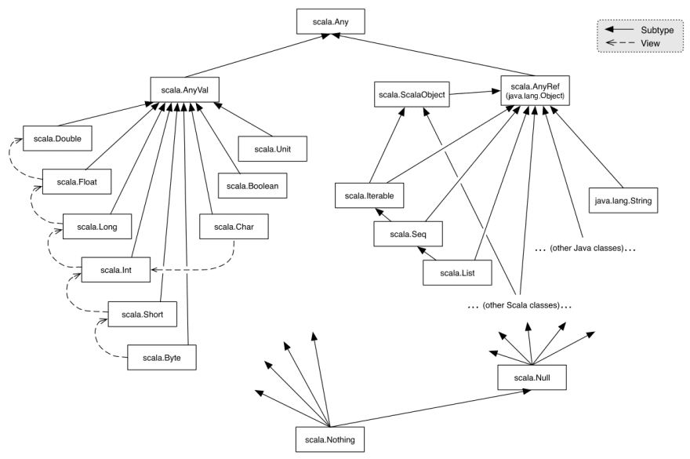

# **<u>Scala: o poder de uma linguagem multiparadigma</u>**

------

[slides](./slides/slides_live_12.pdf)


**Conhecendo o Scala**

Scala combina programação orientada a objetos e programação funcional em uma linguagem concisa de alto nível.

- Scala roda sobre a JVM (Java Virtual Machine), sendo assim, completamente interoperável com Java


**Instalação do JAVA**

Para instalar o open JDK:

- Para instalar o maven em distribuições Linux baseadas
  em apt get

  ```shell
  sudo apt-get install openjdk-8-jdk
  ```

  

- Para instalar o maven em distribuições Linux baseadas
  em yum

  ```shell
  sudo yum install java-1.8.0-openjdk
  ```

  

- Nota: na VM fornecida c/ CentOS 7 já havia instalado a versão "1.8.0_202"


**Instalando Scala**

Para instalar o maven em distribuições Linux baseadas em apt get

```shell
sudo apt-get install scala
```

Para instalar o maven em distribuições Linux baseadas em yum

```shell
baixar o pacote
wget https://downloads.lightbend.com/scala/2.11.12/scala-2.11.12.rpm
# instalar no CentOS
sudo rpm -i scala-2.11.12.rpm
# verifica a instalação
scala -version
```


**Sugestão de gerenciador de pacotes "Apache Maven"**

Apache Maven , ou Maven , é uma ferramenta de automação de compilação utilizada primariamente em projetos Java. Também é utilizada para construir e gerenciar projetos escritos em C#, Ruby, Scala e outras linguagens.

O Maven utiliza um arquivo XML (POM) para descrever o projeto de software sendo construído, suas dependências sobre módulos e componentes externos, a ordem de compilação, diretórios e plugins necessários.

Para instalar o maven em distribuições Linux baseadas em apt get

```shell
sudo apt-get install maven
```


Para instalar o maven em distribuições Linux baseadas em yum

```shell
# instala
sudo yum install maven
# verifica versão do Maven
mvn -v # ou mvn --version
```


Archetypes (modelo de projeto)

Vamos utilizar o Maven para criação do nosso projeto. Utilizaremos o seguinte archetype para gerar as estruturas necessárias:

- Group : net.alchim31.maven (grupo a ser usado)
- ArtifactID : scala archetype simple (nome do seu projeto)
- Version : 1.6 (versão do seu projeto)

Utilizar o comando:  (rodar na pasta onde será criado o projeto)

```shell
mvn archetype:generate -DarchetypeGroupId=net.alchim31.maven -DarchetypeArtifactId=scala-archetype-simple -DarchetypeVersion=1.6
```

Respostas:

- Define value for property 'groupId': br.com.dio

- Define value for property 'artifactId': meuProgramaScala

- Define value for property 'version' 1.0-SNAPSHOT: : 1.0
- Define value for property 'package' br.com.dio: br.com.dio.meuProgramaScala


Ajustes após a criação do projeto

- Deletar o diretório src/test/scala/samples

  ```shell
  rm -r src/test/scala/samples
  ```

  

Ajustes do pom,xml (como na VM não tem VSCode, usei o nano)

- Alterar a linha <scala.version>2.11.5</scala.version> para <scala.version>2.11.12</scala.version>

- Remover a linha <arg>-make:transitive</arg>


Nota: para baixar dependências registradas no maven:

- Ir https://mvnrepository.com/

- Procurar o projeto que queira as dependências.

  - ex. Spark

- Clicar na sua escolha

- E após a listagem das versões, clique na que preferir

- Copie a estrutura de acordo com seu gerenciador

  ```xml
  <!-- Maven -->
  <!-- https://mvnrepository.com/artifact/org.apache.spark/spark-core -->
  <dependency>
      <groupId>org.apache.spark</groupId>
      <artifactId>spark-core_2.11</artifactId>
      <version>2.1.1</version>
  </dependency>
  ```


Executando meu código

- Para gerar o projeto, entre no diretório contendo o arquivo pom.xml do projeto e utilize o comando: 

  ```shell
  # atualiza as dependências e compila o programa
  mvn package
  ```

  Nota: após compilar será gerado uma pasta target c/ meu programa "meuProgramaScala-1.0.jar"

- Para executar o programa:

  ```shell
  # de dentro da pasta target
  scala -classpath meuProgramaScala-1.0.jar br.com.dio.meuProgramaScala.App arg1 arg2
  ```


Criando um jar com todas as dependências dentro (útil caso não haja as dependências baixadas e não tenha como ser baixadas)

nota: técnica conhecida como uberjar ou fatjar

Incluir na tag "plugins" o seguinte plugin:

```xml
<!-- Maven Shade Plugin -->
<plugin>
<groupId>org.apache.maven.plugins</groupId>
<artifactId>maven-shade-plugin</artifactId>
<configuration>
  <createDependencyReducedPom>false</createDependencyReducedPom>
  <filters>
	<filter>
	  <artifact>*:*</artifact>
	  <excludes>
		<exclude>META-INF/*.SF</exclude>
		<exclude>META-INF/*.DSA</exclude>
		<exclude>META-INF/*.RSA</exclude>
	  </excludes>
	</filter>
  </filters>
</configuration>
<executions>
  <execution>
	<phase>package</phase>
	<goals>
	  <goal>shade</goal>
	</goals>
	<configuration>
	  <shadedArtifactAttached>true</shadedArtifactAttached>
	  <shadedClassifierName>shaded</shadedClassifierName>
	  <transformers>
		<transformer implementation="org.apache.maven.plugins.shade.resource.ServicesResourceTransformer" />
		<transformer implementation="org.apache.maven.plugins.shade.resource.ManifestResourceTransformer">
		  <mainClass>br.com.dio.meuProgramaScala.App</mainClass>
		</transformer>
	  </transformers>
	</configuration>
  </execution>
</executions>
</plugin>
```

Agora podemos rodar a aplicação inclusive em ambientes sem o scala instalado

```sh
# atualiza as dependências e compila o programa
mvn package

# executa usando a JVM s/ precisar do scala
java -classpath meuProgramaScala-1.0-shaded.jar br.com.dio.meuProgramaScala.App arg1
```


**Sintaxe do Scala**

Object
O tipo object armazena métodos que serão utilizados sem a necessidade de instancia los. Para quem vem de java, object é o equivalente a um singleton . O objeto principal a ser chamado pelo scala precisa ter o método "def main(args: Array [String])".

- exemplo

```scala
package com.everis

object App{
	def main args : Array String ]){
        println("Hello World!")
	}
}
```


Comentários (igual ao JAVA)

- de uma linha //

  ```scala
  // comentário de 1 linha
  ```

- de bloco /* ... */

  ```scala
  /*
  comentário de em bloco
  ...
  ...
  ...
  */
  ```


**println**: Comando utilizado para imprimir na tela valores do tipo string

- exemplos

  ```scala
  // imprimindo string simples
  println ("Hello, James")
  
  // imprimindo string interpolada c/ variáveis ou  funções
  println (s"1 + 1 = ${1 + 1}")
  
  // imprimindo string interpolada c/ variáveis ou  funções
  val name = "James"
  println (s"Hello, $name")
  ```


Definição de variáveis **var** (pode ter o conteúdo modificado) e **val**(não pode ter o conteúdo modificado)

Há duas maneiras de definir variáveis em scala

- exemplo **var**

  ```scala
  var minhaVariavel = "Valor inicial"
  println(minhaVariavel)
  minhaVariavel = "Valor alterado"
  println(minhaVariavel)
  ```

- exemplo **val**

  ```scala
  val minhaVariavelVal = "Valor inicial"
  println(minhaVariavelVal)
  //O comando abaixo não irá funcionar
  minhaVariavelVal = "Valor alerado"
  // mas se a definição for recriada, sim
  val minhaVariavelVal = "Valor alterado"
  println(minhaVariavelVal)
  
  ```


Tipos de variáveis

Scala, diferentemente de Python e Javascript , é uma linguagem tipada . Em geral, o próprio compilador do Scala se encarrega de inferir o tipo de uma variável, porém, para usufruirmos ao máximo da ferramenta, o ideal é indicarmos o tipo da variável que estamos configurando:

```scala
//O compilador infere que a variável é tipo String
val minhaVariavelNaoTipada = "Valor"

//O compilador espera que o valor seja do tipo String
val minhaVariavelTipada:String = "Valor"
```





Os objetos do Scala contém métodos próprios para conversão entre os tipos básicos:

```scala
val variavelInteira: Int = 30
val variavelDouble: Double = 3.14
val variavelString: String = "35"

val novaString: String = varialvelInteira.toString
val novoFloat: Double = varialvelInteira.toDouble

val novoInteiro1: Int = variavelDouble.toInt
val novaString1: String = variavelDouble.toString

val novoInteiro2: Int = variavelString.toInt
val novaFloat2: Double = variavelString.toDouble
```


Operadores (iguais aos do JAVA)

As operações abaixo podem ser executadas apenas com tipos numéricos (Byte, Short, Int, Long, Float, Double):

| OPERADOR | DESCRIÇÃO                |
| :------: | ------------------------ |
|    +     | adição                   |
|    -     | subtração                |
|    *     | multiplicação            |
|    /     | divisão                  |
|    %     | resto da divisão inteira |

```scala
val variavel1 = 8
val variavel2 = 3
val soma: Int = variavel1 + variavel2
val subtr: Int = variavel1 - variavel2
val mult: Int = variavel1 * variavel2
val divi: Float = variavel1 / variavel2
val resto: Int = variavel1 % variavel2
```


LÓGICOS

| OPERADOR | DESCRIÇÃO                                                    |
| :------: | ------------------------------------------------------------ |
|    =     | Operador de Igual. Retorna True se verdadeiro e False em caso negativo |
|    !=    | Operador de Diferente. Retorna True se verdadeiro e False em caso negativo |
|    >     | Operador de Maior. Retorna True se verdadeiro e False em caso negativo |
|    <     | Operador de Menor. Retorna True se verdadeiro e False em caso negativo |
|    >=    | Operador de Maior ou igual. Retorna True se verdadeiro e False em caso negativo |
|    <=    | Operador de Menor ou igual. Retorna True se verdadeiro e False em caso negativo |
|    !     | Operador lógico NOT. Inverte a lógica de uma operação boolena |
|   \|\|   | Operador lógico OR. Retorna True se um dos dois operandos forem verdadeiros |
|    &&    | Operador lógico AND. Retorna True se os dois operandos forem verdadeiros |


Condicionais (igual JAVA)

O Scala trabalha com condicionais de maneira muito semelhante a outras linguagens:

```scala
//Exemplo de if básico
var condicional = 1
if (condicional == 1) {
	println("Variavel igual a um")
} else{
	println("Variavel não é igual a um")
}
```

```scala
//Exemplo de if concatenado
var condicional = 4
if (condicional == 1){
	println("Variavel igual a um")
} else if (condicional > 3){
	println("Variavel maior que três")
}
```

```scala
//Exemplo de match
val matchVal = 25
matchVal match {
	case 1 => println ("domingo")
	case 2 => println ("segunda")
	case 3 => println ("terça")
	case 4 => println ("quarta")
	case 5 => println ("quinta")
	case 6 => println ("sexta")
	case 7 => println ("Sabado")
	case _ => println("Caso inesperado: " + whoa.toString)
}
```


Iteráveis

Um dos tipos mais comuns de objetos Iteráveis são os **Arrays**.

```scala
// Array Vazio
val meuArray: Array[String] = Array[String]()
//Tamanho (length) do Array
println(s"Tamanho do meu array: ${meuArray.length}")

// Array com três elementos
val meuArray2: Array[String] = Array[String]("Valor 1", "Valor 2", "Valor 3")
// Atualizando seu Array (conteúdo dos itens)
meuArray2.update(0,"Novo Valor2")
// Visualizando dados do Array
println(s"Visualizando dados do meu Array : ${meuArray2(0)}")
```


Arrays são objetos estáticos em Scala; caso necessite de uma estrutura mais maleável, o ideal é utilizar o **ArrayBuffer**.

```scala
//Importando o componente Array Buffer
import scala.collection.mutable.ArrayBuffer

//Instanciando e adicionando elementos
var frutas = ArrayBuffer[String]()
frutas += "Maçã"
frutas += "Banana"
frutas += "Laranja"

println(s"Eu gosto de ${frutas(1)}")
```


**List** são um outro exemplo de iteráveis estáticos. Diferentemente do Array , listas não contém métodos de update:

```scala
//Instanciando uma lista
val minhaLista = List[Int](1, 2, 3, 4)
println(s"Minha Lista contém ${minhaLista(1)} na posição 1")
```


Equivalente dinâmico da lista temos o **ListBuffer **.

```scala
//Importando o componente Array Buffer
import scala.collection.mutable.ListBuffer
//Instanciando e adicionando elementos
val listaMutavel = ListBuffer[String]()
listaMutavel += "maça"
listaMutavel += "banana"
listaMutavel += "laranja"
println(s"Eu gosto de ${listaMutavel(2)}")
```


No Scala temos várias maneiras de Iterar objetos. Um dos mais tradicionais é o laço **for**:

```scala
//Objeto Iteravel
val iteravel:Array[String] = Array [String]("Valor 1", "Valor 2", "Valor 3", "Valor 4", "Valor 5")

//Iterando os valores diretamente
for (valores <- iteravel ){
	println(s"Valor retornado: $valores")
}

//Iterando valores com um índice
for (i <- 0 to iteravel.length -1) {
	println(s"Os valores do objeto são: ${iteravel(i)}")
}
```


No Scala temos várias maneiras de Iterar objetos. Outro método tradicional é o **while**:

```scala
//Objeto Iteravel
val iteravel:Array String ] = Array String ]("Valor 1", "Valor 2", "Valor 3", "Valor 4",
"Valor 5")

//Iterando via while
var i = 0
while (i < iteravel.length){
	println(s"Os valores do objeto usando while : ${iteravel(i)}")
	i += 1
}
```


Quando estamos falando de iterar objetos a melhor maneira de iterarmos um objeto é através dos métodos próprios **foreach** e **map**:

```scala
//Objeto Iteravel
val iteravel:Array[Int] = Array[Int](1,2,3,4,5)
//Iterando via foreach (percorre executa a função lambda, mas não retorna nada)
iteravel.foreach(value => {
	println(s">>> Imprimindo valores com foreach $value")
})

//Iterando via map (percorre executa a função lambda, e retorna um novo objeto atualizado)
val res = iteravel.map(value => {
	value * value
})
//percorre o novo objeto criado
res.foreach(value => {
	println(s">>> Imprimindo valores com foreach $value")
})
```

A principal diferença entre foreach e map é que map retorna um novo objeto iterável com as transformações indicadas dentro da função implícita, enquanto foreach apenas executa a função, sem retornar valores

```scala
//Trabalhando com foreach e map em uma lista de tuplas
val listaDeTuplas = List[(String, Int)](("chave 1", 25), ("chave 2", 30), ("chave 3", 35))
//Imprimindo valores com foreach
listaDeTuplas.foreach(tupla => {
	println(s"Chave: ${tupla._1} - Valor: ${tupla._2}")
})

//Criando uma nova Lista utilizando map
val novaListaDeTuplas: List[(Int, String)] = listaDeTuplas.map(tupla => {
	(tupla._2 * 3, tupla._1)
})

//Usando a função print de maneira implícita
novaListaDeTuplas.foreach(println)
```


Uma outra propriedade útil dos objetos iteráveis do Scala são as funções **filter** e **filternot**:

```scala
//Filtrando lista baseado em uma condição
val listaFiltrada = novaListaDeTuplas.filter(tupla => tupla._1 > 75)
listaFiltrada.foreach(println)

//Filtragem invertida (não satisfazer a condição)
val listaFiltradaInvertida = novaListaDeTuplas.filterNot(tupla => tupla._1 > 75)
listaFiltradaInvertida.foreach(println)
```


Parado em:

- vídeo: 1:27:20
- slide: 38/55