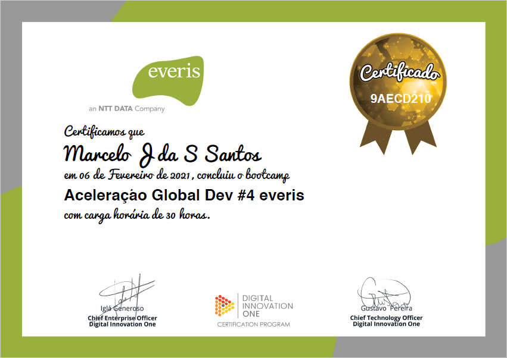

# **<u>Aceleração Global Dev #4 everis - DIO</u>**

------
<table style="width: 100%">
  <tr>
    <td>
      

	
	 
        
        
      

    </td>
  </tr>
</table>

<table style="width: 100%">
  <tr>
    <td>
      

        Repositório criado para armazenar anotações e atividades desempenhadas no treinamento na plataforma da <a href="https://digitalinnovation.one/" target="_blank">Digital Inovattion One (DIO)</a> para o Processo seletivo de Engenheiros de Dados pela empresa <a href="https://www.everis.com/brazil" target="_blank">everis</a>.
      

      

        Este tem tão somente o intuito de ser uma visão particular do autor e servir como uma forma de facilitar o acesso a todo conhecimento adquirido na atividade. Não é intenção do autor abordar de forma completa o conteúdo abordado nem tão pouco substituir o todo ou em parte o material original disponibilizado no <a href="https://web.digitalinnovation.one/acceleration/aceleracao-global-dev-4-everis?tab=path" target="_blank">site</a> do treinamento.
      

    </td>
  </tr>
</table>

------

- Live#01 - Abertura - Como trabalhar em um ambiente ágil e global
	- Especialista: [Ivan Brum - Diretor Data & Analytics, everis](https://www.linkedin.com/in/ivan-brum-960358/)
- [Curso#01 - Linux: A introdução ao sistema operacional](./cursos_01e02)
	- Instrutor: [Bruno Campos](https://www.linkedin.com/in/brunodecamposdias/)
- [Curso#02 - Curso#02 - Shell script - Manipulando Arquivos](./cursos_01e02)
	- Instrutor: [Daviny Vidal](https://www.linkedin.com/in/davinyvidal/)
- [Live#02 - Monitoramento de clusters Hadoop de alto nível com HDFS e Yarn](./live_02)
- [Live#03 - Orquestrando ambientes de big data distruibuidos com Zookeeper, Yarn e Sqoop](./live_03)
	- Especialista: [Rodrigo Garcia - Big Data Projects Team Lead, everis](https://www.linkedin.com/in/rodsantosg/)
- [Live#04 - Como realizar consultas de maneira simples no ambiente complexo de Big Data com HIVE e Impala](./live_04)
	- Especialista: [Vinicius Bueno - Data Engineer and Big Data solutions consultant, everis](https://www.linkedin.com/in/vinicius-m-bueno-br/)
- [Live#05 - Explorando o poder do NoSQL com Cassandra e Hbase](./live_05)
	- Especialista: [Valdir Sevaios - Data & Analytics, everis](https://www.linkedin.com/in/valdir-novo-sevaios-junior-8190a096/)
- [Live#06 - Intensivo de Python: O mínimo que você precisa saber](./live_06)
- [Live#07 - Trabalhando com serviços de mensageria real time com Python e Kafka na prática](./live_07)
- [Live#13 - O que você precisa saber para construir APIs verdadeiramente restfull](./live_13)
	- Especialista: [Hugo de Oliveira Alves - Expert Technology Architect, everis](https://www.linkedin.com/in/huguinho/)
- [Live#08 - Processando grandes conjuntos de dados de forma paralela e distribuída com Spark](./live_08)
- [Live#12 - Scala: o poder de uma linguagem multiparadigma](./live_12)
	- Especialista: [Ivan Falcão - Desenvolvedor Big Data, everis](https://www.linkedin.com/in/ivanpfalcao/)
- [Live#09 - Criando pipelines de dados eficientes - Parte 1 (Spark Streaming e PySpark)](./live_09)
- [LLive#10 - Criando pipelines de dados eficientes - Parte 2 (Spark SQL e PySpark)](./live_10)
	- Especialista: [Marco Antonio Pereira - Expert Data Architect, everis](https://www.linkedin.com/in/marcoap/)
- [Live#11 - Orquestrando Big Data em Ambiente de Nuvem](./live_11)
	- Especialista: [Edmilson Carmo - Big Data Engineer, everis](https://www.linkedin.com/in/edm-carmo/)
- Live#14 - Graduação - habilidades que diferenciam um sênior na everis
	- Especialistas: [Evandro Armelin - Data & Analytics Director, everis](https://www.linkedin.com/in/evandroarmelin/) e [William Seles - Tech Recruiter, everis](https://www.linkedin.com/in/william-seles-464351147/)
